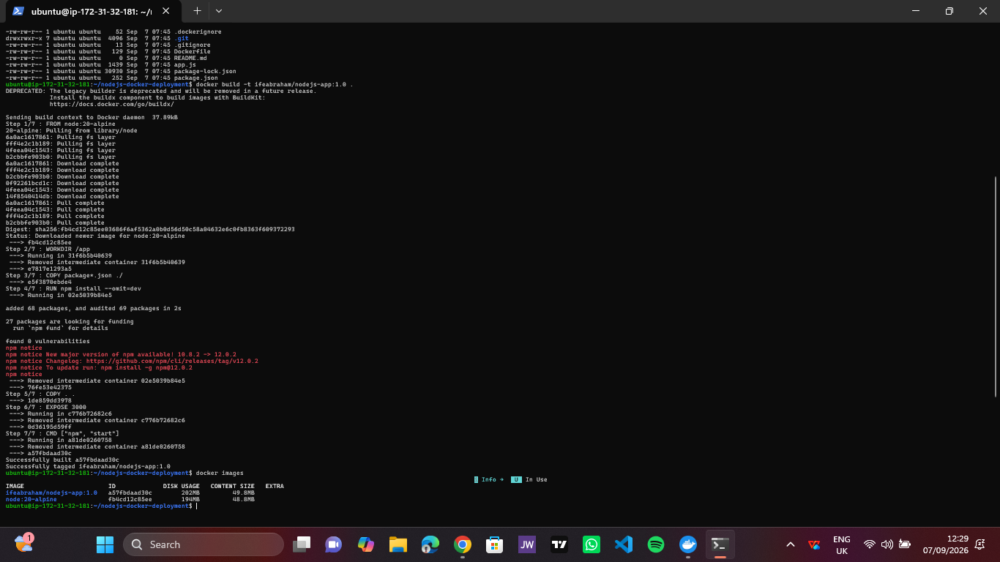
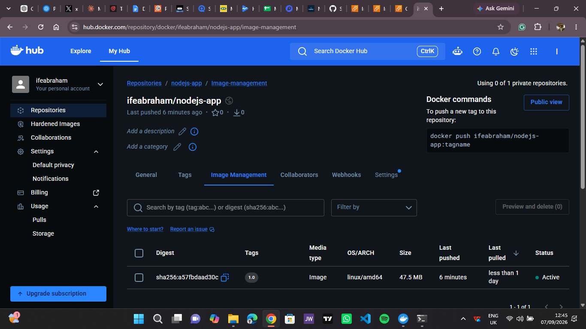
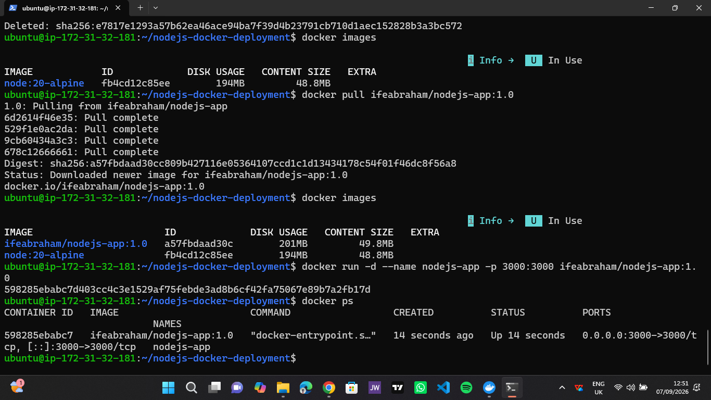
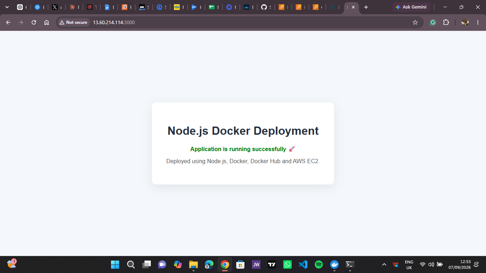

## Docker Image Build

The Docker image was successfully built on the Linux server.

## Docker Hub Image

The image was pushed to my Docker Hub repository with the `1.0` tag.

## Running Docker Container

The container was started with port 3000 mapped from the EC2 host to the application container.

## Live Application

The containerized Node.js application was successfully deployed and accessed through the AWS EC2 public IP address.

